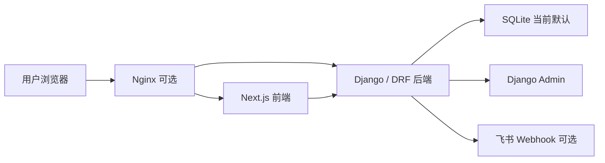

# FieldSense 官网项目交接文档

更新日期：2026-06-24

## 1. 当前项目进展

FieldSense 官网当前处于“官网 MVP + 线索管理增强版”阶段。项目已经具备可运行的前端官网、Django 线索收集后端、Django Admin 管理后台、前端线索管理页面、飞书通知预留和 Docker Compose 部署配置。

已完成的主要功能：

- 前端官网：`/`、`/products`、`/products/fieldsense-nfs`、`/solutions`、`/solutions/pcb-interference-debugging`、`/cases`、`/articles`、`/contact`、`/demo`。
- 首页模块：Hero、适用场景、核心能力、应用场景、产品构成、优势、CTA。
- 产品内容：产品中心列表，以及 `FieldSense NFS 近场扫描系统` 详情页。
- 解决方案内容：解决方案列表，以及 `PCB 板级干扰排查方案` 详情页。
- 内容列表：案例中心和技术文章列表，数据来自 `frontend/src/data`。
- 表单转化：联系我们表单和预约演示表单，提交到后端 API。
- 后端线索：Django `Lead` 模型、创建接口、列表接口、统计接口、详情更新接口、CSV 导出接口。
- 管理能力：Django Admin 支持搜索、筛选、状态修改、批量标记和 CSV 导出。
- 前端线索管理页：`/dashboard/leads` 支持简单管理密码、统计、搜索筛选、分页、状态/备注更新和 CSV 导出。
- 通知能力：默认 console 日志通知，已预留飞书 Webhook 通知。
- 部署配置：Docker Compose 启动 frontend/backend，Nginx profile 代理 `/api/`、`/admin/` 和前端页面，PostgreSQL profile 已预留。

当前未完成或仍是占位状态：

- 真实图片未接入。案例缩略图仍使用 `frontend/public/placeholders/*.svg`，首页和产品页部分视觉块由 CSS 类 `heatmap-surface`、`spectrum-bars`、`scanner-grid` 绘制。
- 内容仍是静态数据，主要集中在 `frontend/src/data`，尚未接 CMS 或后端内容 API。
- 产品详情页目前只有 `fieldsense-nfs`，其他产品还没有独立详情页。
- 方案详情页目前只有 `pcb-interference-debugging`，其他方案还没有独立详情页。
- 技术文章和案例目前是列表页，尚未实现详情页。
- 线索管理页是简单密码方案，不是完整用户体系。
- 后端数据库默认仍是 SQLite，PostgreSQL 只在部署配置中预留。
- 自动化测试体系尚未建立。

## 2. 背景需求

FieldSense 场感是面向近场扫描系统与电磁云图分析平台的企业级产品官网。官网承担两个核心任务：

- 建立产品认知：让硬件研发、EMC、射频和实验室测试团队理解 FieldSense 的近场扫描、频谱采集、云图分析和报告输出能力。
- 获取销售线索：通过预约演示、联系我们、后续资料下载等表单收集客户需求，并支持内部跟进。

目标用户：

- 硬件研发工程师
- EMC 整改工程师
- 射频工程师
- 实验室测试负责人
- 采购和技术评估人员

关键转化路径：

1. 用户从首页理解 FieldSense 的定位和能力。
2. 用户进入产品、解决方案、案例或文章页面确认适配场景。
3. 用户点击 CTA 进入 `/demo` 或 `/contact`。
4. 用户提交表单，后端保存为 Lead。
5. 销售或技术支持在 `/dashboard/leads` 或 Django Admin 中跟进线索。
6. 后续可通过飞书、邮件或 CRM 集成把线索推送给内部团队。

内容建设需求：

- 产品内容需要覆盖系统产品、探头、频谱/采集设备适配、分析软件和配套服务。
- 解决方案需要覆盖 PCB 干扰排查、射频模块分析、EMC 整改验证、天线评估和实验室研发测试。
- 案例内容需要从“占位案例”逐步替换为真实客户场景、真实测试图和可公开结果。
- 技术文章需要从列表占位逐步扩展为可访问详情页，并服务 SEO。

## 3. 当前架构设计

### 3.1 总体架构



本地开发时通常前后端分开运行：

- 前端：`frontend`，默认 `http://localhost:3000`
- 后端：`backend`，默认 `http://localhost:8000`
- 前端通过 `NEXT_PUBLIC_API_BASE_URL` 决定 API 基础地址

生产部署时推荐通过 Nginx 同域代理：

- `/` 转发到 frontend
- `/api/` 转发到 backend
- `/admin/` 转发到 backend

### 3.2 前端架构

技术栈：

- Next.js App Router
- React
- TypeScript
- Tailwind CSS
- lucide-react 图标

关键目录：

- `frontend/src/app`：页面路由。
- `frontend/src/components/home`：首页模块组件。
- `frontend/src/components/business`：产品卡片、方案卡片、文章卡片、案例卡片、联系表单、预约表单。
- `frontend/src/components/ui`：通用 UI 组件。
- `frontend/src/data`：静态业务内容，包括产品、方案、案例、文章、导航配置。
- `frontend/src/lib/api.ts`：API 地址拼接和表单提交。
- `frontend/public`：静态资源，目前主要是 placeholder SVG。

前端数据流：

- 官网内容大多从 `frontend/src/data/*.ts` 静态读取。
- `ContactForm` 调用 `submitContact()`，POST 到 `/api/leads/contact/`。
- `DemoRequestForm` 调用 `submitDemoRequest()`，POST 到 `/api/leads/demo-request/`。
- `/dashboard/leads` 使用 `X-Lead-Admin-Token` 请求线索列表、统计、详情、更新和导出接口。

### 3.3 后端架构

技术栈：

- Django
- Django REST Framework
- SQLite
- requests，用于飞书 Webhook

关键目录：

- `backend/config/settings.py`：Django 配置、CORS、CSRF、线索管理密码、飞书配置。
- `backend/config/urls.py`：后端路由入口。
- `backend/apps/leads/models.py`：Lead 模型。
- `backend/apps/leads/serializers.py`：线索创建、管理列表、更新序列化。
- `backend/apps/leads/views.py`：线索创建、统计、列表、详情更新和 CSV 导出。
- `backend/apps/leads/admin.py`：Django Admin 配置。
- `backend/apps/notifications/services.py`：console 和飞书通知。

主要 API：

- `POST /api/leads/demo-request/`：创建预约演示线索。
- `POST /api/leads/contact/`：创建咨询联系线索。
- `GET /api/leads/stats/`：线索统计，需要 `X-Lead-Admin-Token`。
- `GET /api/leads/`：线索列表，需要 `X-Lead-Admin-Token`。
- `GET /api/leads/<id>/`：线索详情，需要 `X-Lead-Admin-Token`。
- `PATCH /api/leads/<id>/`：更新状态和备注，需要 `X-Lead-Admin-Token`。
- `GET /api/leads/export/`：导出 CSV，需要 `X-Lead-Admin-Token`。

### 3.4 部署架构

部署文件集中在 `deploy`：

- `docker-compose.yml`：frontend、backend、nginx、postgres profile。
- `Dockerfile.frontend`：前端镜像。
- `Dockerfile.backend`：后端镜像。
- `nginx.conf`：反向代理配置。
- `.env.example`：生产环境变量模板。
- `backup_sqlite.sh`：SQLite 备份脚本。

注意事项：

- `deploy/.env` 是本地/服务器私有配置，不应提交真实密钥。
- 当前后端默认使用 SQLite：`SQLITE_DB_PATH`。
- PostgreSQL 服务已预留，但 Django settings 还未切换到 PostgreSQL。

## 4. 下一步开发需求

### P0：近期优先

1. 替换真实图片和视觉资产
   - 新建或整理 `frontend/public/images`。
   - 将案例缩略图从 `/placeholders/*.svg` 替换为真实图片。
   - 将首页、产品页、方案页中的 CSS 绘制视觉块逐步替换为真实设备图、软件截图、云图、测试现场图。
   - 重点文件：`frontend/src/data/cases.ts`、`frontend/src/components/home/HeroSection.tsx`、`frontend/src/components/business/ProductCard.tsx`、`frontend/src/components/home/ApplicationScenarios.tsx`。

2. 补齐内容详情页
   - 为其他产品补详情页：`near-field-probes`、`spectrum-acquisition`、`fieldsense-studio`、`services`。
   - 为其他解决方案补详情页：`rf-module-analysis`、`emc-rectification`、`antenna-field-evaluation`、`lab-rd-testing`。
   - 为案例和文章增加详情页，支持 SEO 长尾流量。

3. 强化线索管理安全
   - 当前 `/dashboard/leads` 是简单密码 + header token。
   - 后续建议改为正式登录态、Django session/JWT、权限分级，并增加操作审计。

4. 建立基础测试
   - 前端至少覆盖表单校验、API 调用失败态、线索管理筛选逻辑。
   - 后端至少覆盖 Lead 创建、必填校验、token 鉴权、CSV 导出。

### P1：稳定上线

- 接入 PostgreSQL，并把数据库配置从 SQLite 迁移到生产级配置。
- 完善生产环境变量、域名、HTTPS、静态资源缓存和日志。
- 增加表单风控：限流、验证码、垃圾线索过滤。
- 完善飞书通知失败告警，视业务需要增加邮件或 CRM 集成。
- 增加 sitemap、robots、结构化数据和更完整的 SEO metadata。
- 建立真实客户案例、产品资料下载和白皮书下载流程。

### P2：内容平台化

- 将产品、方案、案例、文章从静态 TS 数据迁移到 CMS 或 Django API。
- 增加资料下载中心，并把下载行为纳入线索模型。
- 增加访问分析和转化漏斗统计。
- 如需海外市场，规划中英文或多语言架构。

## 5. AI 接手指引

AI 接手本仓库时，先执行以下阅读顺序：

1. 读 `docs/project-handoff.md`，确认当前阶段和下一步优先级。
2. 读用户最新需求，判断是内容、前端、后端、部署还是文档任务。
3. 若涉及产品背景，补读 `docs/product-requirements.md`。
4. 若涉及架构或接口，补读 `docs/technical-design.md` 和相关源码。
5. 若涉及部署，补读 `docs/deploy-guide.md`。

如果用户没有指定具体任务，默认下一步应优先做：

1. 建立真实图片替换通道：整理 `frontend/public/images` 目录规范，并把现有 placeholder 引用改造成容易替换的真实资产路径。
2. 补齐产品和方案详情页：优先从 `frontend/src/data/products.ts` 和 `frontend/src/data/solutions.ts` 中已有静态数据扩展。
3. 为线索管理加基础测试和更可靠鉴权方案。

开发时的约束：

- 不要把真实客户数据、密钥、Webhook、管理密码写进仓库。
- 修改现有页面时优先沿用 Tailwind、现有 UI 组件和 `frontend/src/data` 的数据化模式。
- 处理图片时优先使用 `frontend/public/images/...`，页面中引用 `/images/...`。
- 表单和线索字段要同时检查前端类型、后端 serializer、Lead model 和 Admin 展示。
- 改部署配置时同步检查 `deploy/.env.example`、`docker-compose.yml`、`nginx.conf` 和 `docs/deploy-guide.md`。

常用验证命令：

```bash
cd frontend
npm run lint
npm run build
```

```bash
cd backend
python manage.py check
python manage.py migrate --check
```

完成标准：

- 页面能正常构建或明确说明无法构建的原因。
- 表单提交路径没有被破坏。
- 新增功能在文档中能找到入口或说明。
- 若改变接口字段，前端类型、后端 serializer、Admin、文档同步更新。
